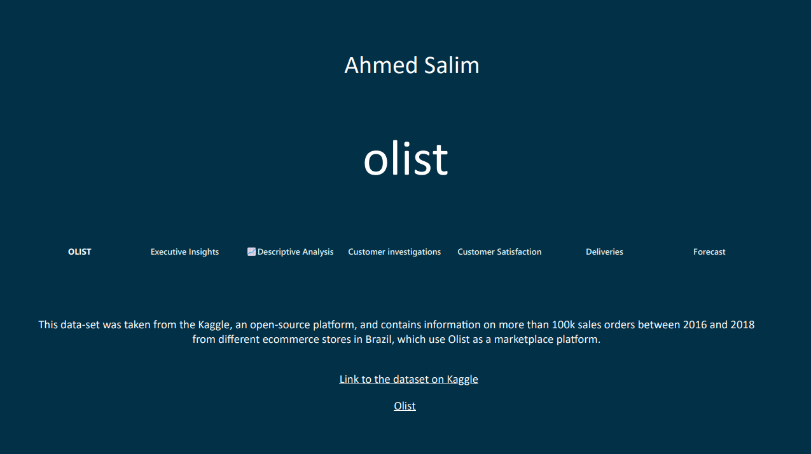

# OLIST E-Commerce Reporting Dashboard

 [[`Blog`](https://ahmedsalim3.github.io/posts/olist-dashboards/)] [[`Dashboard`](https://app.powerbi.com/view?r=eyJrIjoiMTAxNzk2NzYtNjNiNi00NGNiLWJkNjYtMzhmOWViNTUyNzA3IiwidCI6IjBlMGRiMmFkLWM0MTYtNDdjNy04OGVjLWNlYWM0ZWU3Njc2NyIsImMiOjEwfQ%3D%3D&pageName=ReportSectioncc096a47c2520501357d)] [[`Datasets`](https://www.kaggle.com/datasets/olistbr/brazilian-ecommerce)] [[`Google Drive`](https://drive.google.com/drive/folders/1-bi46DjZcHfBCqSpYYNDjzb_a2gRq1El?usp=sharing)]

Due to the large size of the `.pbix` file, I have uploaded it to [Google Drive](https://drive.google.com/drive/folders/1-bi46DjZcHfBCqSpYYNDjzb_a2gRq1El?usp=sharing). Along with the file, you’ll also find the dataset used, which was retrieved from [Kaggle](https://www.kaggle.com/datasets/olistbr/brazilian-ecommerce).

You can read more about the project on my [blog](https://ahmedsalim3.github.io/posts/olist-dashboards/) or the [report](./project-report.pdf). If you have any questions or need further assistance, feel free to contact me. I’m happy to help!

Happy Power BI'ing! 😉
