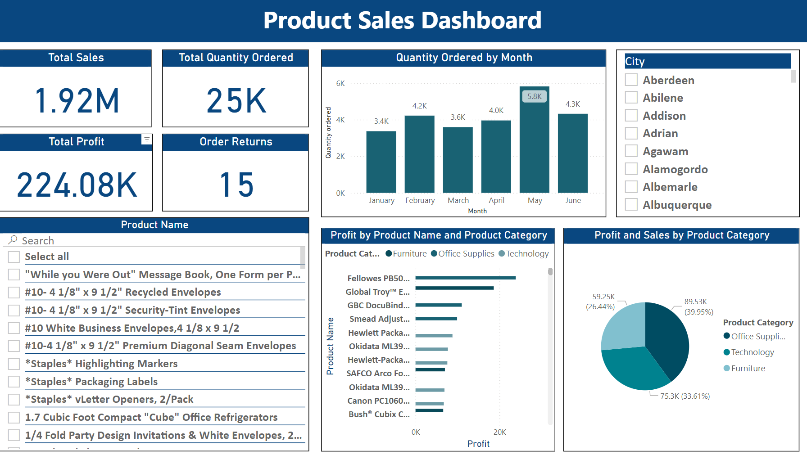

# Power BI Tutorial: Tips for Clear Data Visualizations

 [[`Blog`](https://ahmedsalim3.github.io/posts/powerbi-tutorial/)] [[`Dashboard`](https://app.powerbi.com/view?r=eyJrIjoiZjYwZjIzODktZGY0Ni00Y2UyLTg0YTItODMzOTZhOTIxYTlmIiwidCI6IjBlMGRiMmFkLWM0MTYtNDdjNy04OGVjLWNlYWM0ZWU3Njc2NyIsImMiOjEwfQ%3D%3D&pageName=ReportSectionf41a13297f1ea9120f47)] [[`Datasets`](#download-practice-datasets)]

# Download Practice Datasets

The practice datasets used in this study was derived from this [tutorial](https://www.superdatascience.com/pages/powerbi), Published by **SuperDataScience Team**: 

## Section 1: Getting Started
This is an Excel file. If you do not have excel then you can download Open Office (www.openoffice.org) for Free. It also works on Mac.

[SuperStoreUS-2015.xlsx](https://sds-platform-private.s3-us-east-2.amazonaws.com/uploads/P6-SuperStoreUS-2015.xlsx)

## Section 2: Your first Barchart in Power Bi
In this section we learn how to work with CSV (comma separated values) files.

[OfficeSupplies.csv](https://sds-platform-private.s3-us-east-2.amazonaws.com/uploads/P6-OfficeSupplies.csv)

## Section 3: Timeseries, Aggregation and Filters
Once again, we will be working with an Excel file.

[Long-Term-Unemployment-Statistics.xlsx](https://sds-platform-private.s3-us-east-2.amazonaws.com/uploads/P6-Long-Term-Unemployment-Statistics.xlsx)

## Section 4: Maps and Scatterplots
The attached excel file has two tabs. You will need to join the two tables in Power BI.

[AmazingMartEU2Geo.xlsx](https://sds-platform-private.s3-us-east-2.amazonaws.com/uploads/P6-AmazingMartEU2Geo.xlsx)

## Section 5: Building a Robust Bi Dashboard
Today's dataset is dummy data for an imaginary bank operating in the UK.

[UK-Bank-Customers.csv](https://sds-platform-private.s3-us-east-2.amazonaws.com/uploads/P6-UK-Bank-Customers.csv)

## Section 6: Leveraging Custom Visuals
Today's dataset is the real data relating to the European Debt crisis as at 2011.

[EuroDebtCrisis.csv](https://sds-platform-private.s3-us-east-2.amazonaws.com/uploads/P6-EuroDebtCrisis.csv)
